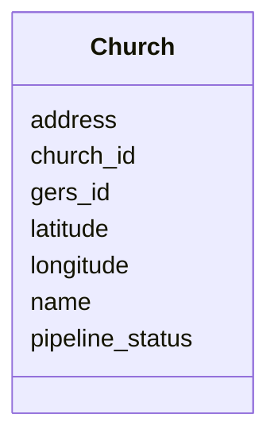

# Class: Church 


_A distinct church congregation._


URI: [gc:Church](https://global.church/schema/Church)





<!-- no inheritance hierarchy -->


## Slots

| Name | Cardinality and Range | Description | Inheritance |
| ---  | --- | --- | --- |
| [church_id](church_id.md) | 1 <br/> [Uuid](Uuid.md) | Primary key for Church; referenced by related tables | direct |
| [gers_id](gers_id.md) | 0..1 <br/> [String](String.md) | ID from the Government/Ecclesiastical Registry System (if available) | direct |
| [name](name.md) | 0..1 <br/> [String](String.md) | Official church name | direct |
| [pipeline_status](pipeline_status.md) | 0..1 <br/> [String](String.md) | Enrichment pipeline stage (e | direct |
| [latitude](latitude.md) | 0..1 <br/> [Float](Float.md) | Geographic latitude (decimal degrees) | direct |
| [longitude](longitude.md) | 0..1 <br/> [Float](Float.md) | Geographic longitude (decimal degrees) | direct |
| [address](address.md) | 0..1 <br/> [String](String.md) | Physical street address | direct |


## Identifier and Mapping Information


### Schema Source


* from schema: https://global.church/schema


## Mappings

| Mapping Type | Mapped Value |
| ---  | ---  |
| self | gc:Church |
| native | gc:Church |
| undefined | schema:Church, schema:Organization |


## LinkML Source

<!-- TODO: investigate https://stackoverflow.com/questions/37606292/how-to-create-tabbed-code-blocks-in-mkdocs-or-sphinx -->

### Direct

<details>
```yaml
name: Church
description: A distinct church congregation.
in_subset:
- church_core
- public
from_schema: https://global.church/schema
mappings:
- schema:Church
- schema:Organization
slots:
- church_id
- gers_id
- name
- pipeline_status
- latitude
- longitude
- address

```
</details>

### Induced

<details>
```yaml
name: Church
description: A distinct church congregation.
in_subset:
- church_core
- public
from_schema: https://global.church/schema
mappings:
- schema:Church
- schema:Organization
attributes:
  church_id:
    name: church_id
    description: Primary key for Church; referenced by related tables. Issued by Global.Church.
    in_subset:
    - church_core
    - public
    from_schema: https://global.church/schema
    rank: 1000
    identifier: true
    alias: church_id
    owner: Church
    domain_of:
    - Church
    - ChurchWebsite
    - EnrichedData
    range: uuid
    required: true
  gers_id:
    name: gers_id
    description: ID from the Government/Ecclesiastical Registry System (if available).
    in_subset:
    - overture
    - public
    from_schema: https://global.church/schema
    rank: 1000
    alias: gers_id
    owner: Church
    domain_of:
    - Church
    - Overture
    range: string
  name:
    name: name
    description: Official church name.
    in_subset:
    - church_core
    - public
    from_schema: https://global.church/schema
    exact_mappings:
    - schema:name
    rank: 1000
    alias: name
    owner: Church
    domain_of:
    - Church
    range: string
  pipeline_status:
    name: pipeline_status
    description: Enrichment pipeline stage (e.g., RAW, CLEAN, ENRICHED, VALIDATED).
    in_subset:
    - internal
    from_schema: https://global.church/schema
    rank: 1000
    alias: pipeline_status
    owner: Church
    domain_of:
    - Church
    range: string
  latitude:
    name: latitude
    description: Geographic latitude (decimal degrees).
    in_subset:
    - church_core
    - public
    from_schema: https://global.church/schema
    exact_mappings:
    - schema:latitude
    rank: 1000
    alias: latitude
    owner: Church
    domain_of:
    - Church
    range: float
  longitude:
    name: longitude
    description: Geographic longitude (decimal degrees).
    in_subset:
    - church_core
    - public
    from_schema: https://global.church/schema
    exact_mappings:
    - schema:longitude
    rank: 1000
    alias: longitude
    owner: Church
    domain_of:
    - Church
    range: float
  address:
    name: address
    description: Physical street address.
    in_subset:
    - church_core
    - public
    from_schema: https://global.church/schema
    exact_mappings:
    - schema:address
    rank: 1000
    alias: address
    owner: Church
    domain_of:
    - Church
    range: string

```
</details>