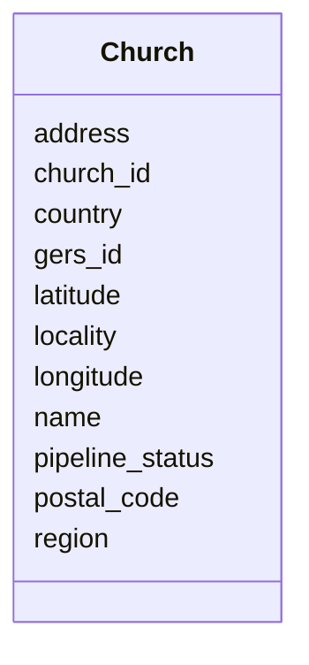

# Class: Church 


_A distinct church congregation._


URI: [gc:Church](https://global.church/schema/Church)





<!-- no inheritance hierarchy -->


## Slots

| Name | Cardinality and Range | Description | Inheritance |
| ---  | --- | --- | --- |
| [church_id](church_id.md) | 1 <br/> [Uuid](Uuid.md) | Global | direct |
| [gers_id](gers_id.md) | 0..1 <br/> [String](String.md) | Government/Ecclesiastical Registry System identifier | direct |
| [name](name.md) | 1 <br/> [String](String.md) | Official church name | direct |
| [pipeline_status](pipeline_status.md) | 0..1 <br/> [String](String.md) | Current enrichment pipeline stage | direct |
| [latitude](latitude.md) | 0..1 <br/> [Float](Float.md) | Latitude in decimal degrees | direct |
| [longitude](longitude.md) | 0..1 <br/> [Float](Float.md) | Longitude in decimal degrees | direct |
| [address](address.md) | 0..1 <br/> [String](String.md) | Physical street address of the church or user | direct |
| [locality](locality.md) | 0..1 <br/> [String](String.md) | City or locality where the church is located | direct |
| [region](region.md) | 0..1 <br/> [String](String.md) | State, province, or administrative region | direct |
| [postal_code](postal_code.md) | 0..1 <br/> [String](String.md) | Postal code or ZIP code for the address | direct |
| [country](country.md) | 1 <br/> [IsoCountryCode](IsoCountryCode.md) | Country code in ISO 3166-1 alpha-2 format | direct |


## Identifier and Mapping Information


### Schema Source


* from schema: https://global.church/schema


## Mappings

| Mapping Type | Mapped Value |
| ---  | ---  |
| self | gc:Church |
| native | gc:Church |
| undefined | schema:Church, schema:Organization |


## LinkML Source

<!-- TODO: investigate https://stackoverflow.com/questions/37606292/how-to-create-tabbed-code-blocks-in-mkdocs-or-sphinx -->

### Direct

<details>
```yaml
name: Church
description: A distinct church congregation.
in_subset:
- church_core
- public
from_schema: https://global.church/schema
mappings:
- schema:Church
- schema:Organization
rank: 1000
slots:
- church_id
- gers_id
- name
- pipeline_status
- latitude
- longitude
- address
- locality
- region
- postal_code
- country
slot_usage:
  church_id:
    name: church_id
    required: true
  name:
    name: name
    required: true
  country:
    name: country
    required: true

```
</details>

### Induced

<details>
```yaml
name: Church
description: A distinct church congregation.
in_subset:
- church_core
- public
from_schema: https://global.church/schema
mappings:
- schema:Church
- schema:Organization
rank: 1000
slot_usage:
  church_id:
    name: church_id
    required: true
  name:
    name: name
    required: true
  country:
    name: country
    required: true
attributes:
  church_id:
    name: church_id
    description: Global.Church-issued ID for a church.
    comments:
    - 'Primary key for the Church entity. Stable and non-reassignable.

      Used as the foreign key for ChurchWebsite, EnrichedData, and other related records.

      '
    examples:
    - value: 9e1c2a7d-4c33-4b8b-9d7a-1a2b3c4d5e6f
      description: Example church UUID.
    in_subset:
    - church_core
    - public
    from_schema: https://global.church/schema
    rank: 1000
    identifier: true
    alias: church_id
    owner: Church
    domain_of:
    - Church
    - ChurchWebsite
    - EnrichedData
    range: uuid
    required: true
  gers_id:
    name: gers_id
    description: Government/Ecclesiastical Registry System identifier.
    comments:
    - 'External registry identifier used for cross-referencing with official listings.

      May not exist for all churches.

      '
    examples:
    - value: GERS-CA-00012345
      description: Sample registry ID.
    in_subset:
    - overture
    - public
    from_schema: https://global.church/schema
    rank: 1000
    alias: gers_id
    owner: Church
    domain_of:
    - Church
    - Overture
    range: string
  name:
    name: name
    description: Official church name.
    comments:
    - 'Use the legal or commonly recognized name (e.g., “Grace Community Church”).

      If there is a campus name or colloquial short name, store it in `alternate_name`.

      '
    examples:
    - value: Grace Community Church
      description: Formal church name.
    - value: Grace Church Malibu
      description: Name with locality qualifier.
    in_subset:
    - church_core
    - public
    from_schema: https://global.church/schema
    exact_mappings:
    - schema:name
    rank: 1000
    alias: name
    owner: Church
    domain_of:
    - Church
    range: string
    required: true
  pipeline_status:
    name: pipeline_status
    description: Current enrichment pipeline stage.
    comments:
    - 'Suggested stages: RAW → CLEAN → ENRICHED → VALIDATED.

      RAW: ingested with minimal checks.

      CLEAN: deduplicated & normalized.

      ENRICHED: scraped/AI fields added.

      VALIDATED: human-reviewed.

      '
    examples:
    - value: RAW
      description: Fresh intake from a seed source.
    - value: VALIDATED
      description: Reviewed and approved record.
    in_subset:
    - internal
    from_schema: https://global.church/schema
    rank: 1000
    alias: pipeline_status
    owner: Church
    domain_of:
    - Church
    range: string
  latitude:
    name: latitude
    description: Latitude in decimal degrees.
    comments:
    - 'Use WGS84 decimal degrees. South is negative.

      Precision of 5–6 decimal places is typically sufficient (~1–10 meters).

      '
    examples:
    - value: '34.0259'
      description: Approximate latitude for Malibu, CA.
    - value: '-33.8688'
      description: Southern hemisphere example (Sydney).
    in_subset:
    - church_core
    - public
    from_schema: https://global.church/schema
    exact_mappings:
    - schema:latitude
    rank: 1000
    alias: latitude
    owner: Church
    domain_of:
    - Church
    range: float
    minimum_value: -90
    maximum_value: 90
  longitude:
    name: longitude
    description: Longitude in decimal degrees.
    comments:
    - 'Use WGS84 decimal degrees. West is negative.

      Keep latitude/longitude pairs from the same source to avoid mismatch.

      '
    examples:
    - value: '-118.7798'
      description: Approximate longitude for Malibu, CA.
    - value: '151.2093'
      description: Eastern hemisphere example (Sydney).
    in_subset:
    - church_core
    - public
    from_schema: https://global.church/schema
    exact_mappings:
    - schema:longitude
    rank: 1000
    alias: longitude
    owner: Church
    domain_of:
    - Church
    range: float
    minimum_value: -180
    maximum_value: 180
  address:
    name: address
    description: Physical street address of the church or user.
    comments:
    - 'This is the official mailing or street address, suitable for postal delivery
      and mapping.

      Always include street number, street name, and any suite or apartment details
      if applicable.

      Follow the local postal format for the country (e.g., street before city in
      the US).

      Avoid using P.O. boxes unless it is the only available mailing address for the
      entity.

      For international addresses, include all relevant locality and region information.

      Use this slot for the canonical address, not for addresses scraped from websites
      (see `scraped_address`).

      '
    examples:
    - value: 123 Main St, Springfield, IL 62704
      description: Standard U.S. street address.
    - value: 10 Downing St, London SW1A 2AA
      description: UK address with postal code.
    in_subset:
    - church_core
    - public
    from_schema: https://global.church/schema
    rank: 1000
    alias: address
    owner: Church
    domain_of:
    - Church
    range: string
  locality:
    name: locality
    description: City or locality where the church is located.
    comments:
    - 'The city, town, or locality where the church''s primary address is situated.

      Use the official or most commonly recognized municipality name.

      This value should match the locality as used by local postal authorities.

      For rural areas without a city, use the nearest recognized locality.

      '
    examples:
    - value: Springfield
      description: US city.
    - value: Sydney
      description: Major city in Australia.
    in_subset:
    - church_core
    - public
    from_schema: https://global.church/schema
    exact_mappings:
    - schema:addressLocality
    rank: 1000
    alias: locality
    owner: Church
    domain_of:
    - Church
    range: string
  region:
    name: region
    description: State, province, or administrative region.
    comments:
    - 'The primary administrative subdivision for the locality, such as state (US),
      province (Canada), or region (EU).

      Use the full name or standard abbreviation as appropriate for the country.

      For countries without such subdivisions, leave this slot empty.

      '
    examples:
    - value: CA
      description: California (US state abbreviation).
    - value: New South Wales
      description: Australian state.
    in_subset:
    - church_core
    - public
    from_schema: https://global.church/schema
    exact_mappings:
    - schema:addressRegion
    rank: 1000
    alias: region
    owner: Church
    domain_of:
    - Church
    range: string
  postal_code:
    name: postal_code
    description: Postal code or ZIP code for the address.
    comments:
    - 'The postal (ZIP) code as assigned by the national postal authority.

      Use the correct format for the country (e.g., 12345 or 12345-6789 in the US,
      SW1A 2AA in the UK).

      Always include this value for postal addresses if available.

      '
    examples:
    - value: '62704'
      description: US ZIP code.
    - value: SW1A 2AA
      description: UK postal code.
    in_subset:
    - church_core
    - public
    from_schema: https://global.church/schema
    exact_mappings:
    - schema:postalCode
    rank: 1000
    alias: postal_code
    owner: Church
    domain_of:
    - Church
    range: string
  country:
    name: country
    description: Country code in ISO 3166-1 alpha-2 format.
    comments:
    - 'Use the two-letter ISO 3166-1 alpha-2 code (e.g., US, GB, AU).

      This field is required for all church records.

      Do not use full country names or three-letter codes.

      '
    examples:
    - value: US
      description: United States.
    - value: NG
      description: Nigeria.
    in_subset:
    - church_core
    - public
    from_schema: https://global.church/schema
    exact_mappings:
    - schema:addressCountry
    rank: 1000
    alias: country
    owner: Church
    domain_of:
    - Church
    range: iso_country_code
    required: true

```
</details>