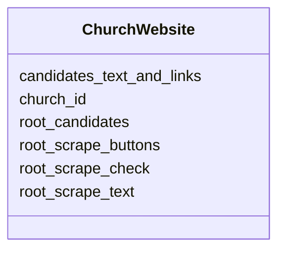

# Class: ChurchWebsite 


_Raw scrape artifacts captured from the church root URL._


URI: [gc:ChurchWebsite](https://global.church/schema/ChurchWebsite)





<!-- no inheritance hierarchy -->


## Slots

| Name | Cardinality and Range | Description | Inheritance |
| ---  | --- | --- | --- |
| [church_id](church_id.md) | 1 <br/> [Uuid](Uuid.md) | Primary key for Church; referenced by related tables | direct |
| [root_scrape_text](root_scrape_text.md) | 0..1 <br/> [String](String.md) | Visible text scraped from the root page | direct |
| [root_scrape_buttons](root_scrape_buttons.md) | 0..1 <br/> [String](String.md) | Button texts captured on root page | direct |
| [root_scrape_check](root_scrape_check.md) | 0..1 <br/> [String](String.md) | Checksum or status flag of the scrape | direct |
| [root_candidates](root_candidates.md) | 0..1 <br/> [String](String.md) | Candidate URLs extracted from the root page | direct |
| [candidates_text_and_links](candidates_text_and_links.md) | 0..1 <br/> [String](String.md) | Text and associated links for candidate pages | direct |


## Identifier and Mapping Information


### Schema Source


* from schema: https://global.church/schema


## Mappings

| Mapping Type | Mapped Value |
| ---  | ---  |
| self | gc:ChurchWebsite |
| native | gc:ChurchWebsite |


## LinkML Source

<!-- TODO: investigate https://stackoverflow.com/questions/37606292/how-to-create-tabbed-code-blocks-in-mkdocs-or-sphinx -->

### Direct

<details>
```yaml
name: ChurchWebsite
description: Raw scrape artifacts captured from the church root URL.
from_schema: https://global.church/schema
slots:
- church_id
- root_scrape_text
- root_scrape_buttons
- root_scrape_check
- root_candidates
- candidates_text_and_links

```
</details>

### Induced

<details>
```yaml
name: ChurchWebsite
description: Raw scrape artifacts captured from the church root URL.
from_schema: https://global.church/schema
attributes:
  church_id:
    name: church_id
    description: Primary key for Church; referenced by related tables.
    from_schema: https://global.church/schema
    rank: 1000
    identifier: true
    alias: church_id
    owner: ChurchWebsite
    domain_of:
    - Church
    - ChurchWebsite
    - EnrichedData
    range: uuid
    required: true
  root_scrape_text:
    name: root_scrape_text
    description: Visible text scraped from the root page.
    from_schema: https://global.church/schema
    rank: 1000
    alias: root_scrape_text
    owner: ChurchWebsite
    domain_of:
    - ChurchWebsite
    range: string
  root_scrape_buttons:
    name: root_scrape_buttons
    description: Button texts captured on root page.
    from_schema: https://global.church/schema
    rank: 1000
    alias: root_scrape_buttons
    owner: ChurchWebsite
    domain_of:
    - ChurchWebsite
    range: string
  root_scrape_check:
    name: root_scrape_check
    description: Checksum or status flag of the scrape.
    from_schema: https://global.church/schema
    rank: 1000
    alias: root_scrape_check
    owner: ChurchWebsite
    domain_of:
    - ChurchWebsite
    range: string
  root_candidates:
    name: root_candidates
    description: Candidate URLs extracted from the root page.
    from_schema: https://global.church/schema
    rank: 1000
    alias: root_candidates
    owner: ChurchWebsite
    domain_of:
    - ChurchWebsite
    range: string
  candidates_text_and_links:
    name: candidates_text_and_links
    description: Text and associated links for candidate pages.
    from_schema: https://global.church/schema
    rank: 1000
    alias: candidates_text_and_links
    owner: ChurchWebsite
    domain_of:
    - ChurchWebsite
    range: string

```
</details>