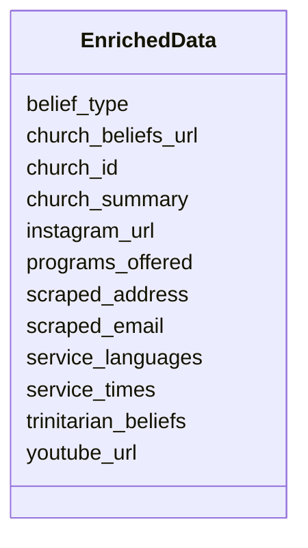

# Class: EnrichedData 


_AI-enriched attributes extracted from the church website and socials._


URI: [gc:EnrichedData](https://global.church/schema/EnrichedData)





<!-- no inheritance hierarchy -->


## Slots

| Name | Cardinality and Range | Description | Inheritance |
| ---  | --- | --- | --- |
| [church_id](church_id.md) | 1 <br/> [Uuid](Uuid.md) | Primary key for Church; referenced by related tables | direct |
| [service_times](service_times.md) | 0..1 <br/> [String](String.md) | Service times (free text) | direct |
| [church_beliefs_url](church_beliefs_url.md) | 0..1 <br/> [Uri](Uri.md) | URL of the statement of faith or similar statement of beliefs | direct |
| [trinitarian_beliefs](trinitarian_beliefs.md) | 0..1 <br/> [Boolean](Boolean.md) | True if church affirms classical Trinitarian doctrine | direct |
| [belief_type](belief_type.md) | 0..1 <br/> [String](String.md) | Denomination / church type category | direct |
| [scraped_email](scraped_email.md) | 0..1 <br/> [String](String.md) | Email address extracted from site | direct |
| [instagram_url](instagram_url.md) | 0..1 <br/> [Uri](Uri.md) | Instagram profile URL | direct |
| [youtube_url](youtube_url.md) | 0..1 <br/> [Uri](Uri.md) | YouTube channel URL | direct |
| [service_languages](service_languages.md) | 0..1 <br/> [String](String.md) | Languages in which services are offered | direct |
| [scraped_address](scraped_address.md) | 0..1 <br/> [String](String.md) | Postal address extracted from site | direct |
| [programs_offered](programs_offered.md) | 0..1 <br/> [String](String.md) | List of programs or ministries offered | direct |
| [church_summary](church_summary.md) | 0..1 <br/> [String](String.md) | Concise summary of the church, including key attributes and offerings | direct |


## Identifier and Mapping Information


### Schema Source


* from schema: https://global.church/schema


## Mappings

| Mapping Type | Mapped Value |
| ---  | ---  |
| self | gc:EnrichedData |
| native | gc:EnrichedData |


## LinkML Source

<!-- TODO: investigate https://stackoverflow.com/questions/37606292/how-to-create-tabbed-code-blocks-in-mkdocs-or-sphinx -->

### Direct

<details>
```yaml
name: EnrichedData
description: AI-enriched attributes extracted from the church website and socials.
from_schema: https://global.church/schema
slots:
- church_id
- service_times
- church_beliefs_url
- trinitarian_beliefs
- belief_type
- scraped_email
- instagram_url
- youtube_url
- service_languages
- scraped_address
- programs_offered
- church_summary

```
</details>

### Induced

<details>
```yaml
name: EnrichedData
description: AI-enriched attributes extracted from the church website and socials.
from_schema: https://global.church/schema
attributes:
  church_id:
    name: church_id
    description: Primary key for Church; referenced by related tables.
    from_schema: https://global.church/schema
    rank: 1000
    identifier: true
    alias: church_id
    owner: EnrichedData
    domain_of:
    - Church
    - ChurchWebsite
    - EnrichedData
    range: uuid
    required: true
  service_times:
    name: service_times
    description: Service times (free text).
    from_schema: https://global.church/schema
    rank: 1000
    alias: service_times
    owner: EnrichedData
    domain_of:
    - EnrichedData
    range: string
  church_beliefs_url:
    name: church_beliefs_url
    description: URL of the statement of faith or similar statement of beliefs.
    from_schema: https://global.church/schema
    rank: 1000
    alias: church_beliefs_url
    owner: EnrichedData
    domain_of:
    - EnrichedData
    range: uri
  trinitarian_beliefs:
    name: trinitarian_beliefs
    description: True if church affirms classical Trinitarian doctrine.
    from_schema: https://global.church/schema
    rank: 1000
    alias: trinitarian_beliefs
    owner: EnrichedData
    domain_of:
    - EnrichedData
    range: boolean
  belief_type:
    name: belief_type
    description: Denomination / church type category.
    from_schema: https://global.church/schema
    rank: 1000
    alias: belief_type
    owner: EnrichedData
    domain_of:
    - EnrichedData
    range: string
  scraped_email:
    name: scraped_email
    description: Email address extracted from site.
    from_schema: https://global.church/schema
    exact_mappings:
    - schema:email
    rank: 1000
    alias: scraped_email
    owner: EnrichedData
    domain_of:
    - EnrichedData
    range: string
  instagram_url:
    name: instagram_url
    description: Instagram profile URL.
    from_schema: https://global.church/schema
    exact_mappings:
    - schema:sameAs
    rank: 1000
    alias: instagram_url
    owner: EnrichedData
    domain_of:
    - EnrichedData
    range: uri
  youtube_url:
    name: youtube_url
    description: YouTube channel URL.
    from_schema: https://global.church/schema
    exact_mappings:
    - schema:sameAs
    rank: 1000
    alias: youtube_url
    owner: EnrichedData
    domain_of:
    - EnrichedData
    range: uri
  service_languages:
    name: service_languages
    description: Languages in which services are offered.
    from_schema: https://global.church/schema
    exact_mappings:
    - schema:inLanguage
    rank: 1000
    alias: service_languages
    owner: EnrichedData
    domain_of:
    - EnrichedData
    range: string
  scraped_address:
    name: scraped_address
    description: Postal address extracted from site.
    from_schema: https://global.church/schema
    exact_mappings:
    - schema:address
    rank: 1000
    alias: scraped_address
    owner: EnrichedData
    domain_of:
    - EnrichedData
    range: string
  programs_offered:
    name: programs_offered
    description: List of programs or ministries offered.
    from_schema: https://global.church/schema
    exact_mappings:
    - schema:service
    rank: 1000
    alias: programs_offered
    owner: EnrichedData
    domain_of:
    - EnrichedData
    range: string
  church_summary:
    name: church_summary
    description: Concise summary of the church, including key attributes and offerings.
    from_schema: https://global.church/schema
    rank: 1000
    alias: church_summary
    owner: EnrichedData
    domain_of:
    - EnrichedData
    range: string

```
</details>