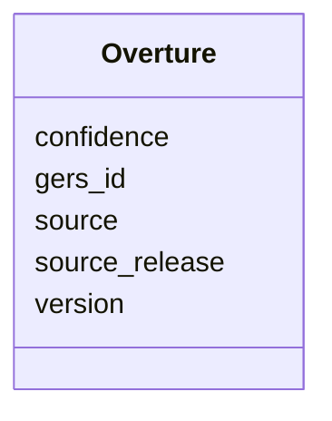

# Class: Overture 


_Original place record as supplied by Overture Maps._


URI: [gc:Overture](https://global.church/schema/Overture)





<!-- no inheritance hierarchy -->


## Slots

| Name | Cardinality and Range | Description | Inheritance |
| ---  | --- | --- | --- |
| [gers_id](gers_id.md) | 0..1 <br/> [String](String.md) | ID from the Government/Ecclesiastical Registry System (if available) | direct |
| [version](version.md) | 0..1 <br/> [Integer](Integer.md) | Overture version number | direct |
| [source](source.md) | 0..1 <br/> [String](String.md) | Source label of the Overture record | direct |
| [confidence](confidence.md) | 0..1 <br/> [Float](Float.md) | Confidence score (0–1) | direct |
| [source_release](source_release.md) | 0..1 <br/> [String](String.md) | Overture release tag (e | direct |


## Identifier and Mapping Information


### Schema Source


* from schema: https://global.church/schema


## Mappings

| Mapping Type | Mapped Value |
| ---  | ---  |
| self | gc:Overture |
| native | gc:Overture |


## LinkML Source

<!-- TODO: investigate https://stackoverflow.com/questions/37606292/how-to-create-tabbed-code-blocks-in-mkdocs-or-sphinx -->

### Direct

<details>
```yaml
name: Overture
description: Original place record as supplied by Overture Maps.
from_schema: https://global.church/schema
slots:
- gers_id
- version
- source
- confidence
- source_release

```
</details>

### Induced

<details>
```yaml
name: Overture
description: Original place record as supplied by Overture Maps.
from_schema: https://global.church/schema
attributes:
  gers_id:
    name: gers_id
    description: ID from the Government/Ecclesiastical Registry System (if available).
    from_schema: https://global.church/schema
    rank: 1000
    alias: gers_id
    owner: Overture
    domain_of:
    - Church
    - Overture
    range: string
  version:
    name: version
    description: Overture version number.
    from_schema: https://global.church/schema
    rank: 1000
    alias: version
    owner: Overture
    domain_of:
    - Overture
    range: integer
  source:
    name: source
    description: Source label of the Overture record.
    from_schema: https://global.church/schema
    rank: 1000
    alias: source
    owner: Overture
    domain_of:
    - Overture
    range: string
  confidence:
    name: confidence
    description: Confidence score (0–1).
    from_schema: https://global.church/schema
    rank: 1000
    alias: confidence
    owner: Overture
    domain_of:
    - Overture
    range: float
  source_release:
    name: source_release
    description: Overture release tag (e.g., 2024-05-15).
    from_schema: https://global.church/schema
    rank: 1000
    alias: source_release
    owner: Overture
    domain_of:
    - Overture
    range: string

```
</details>