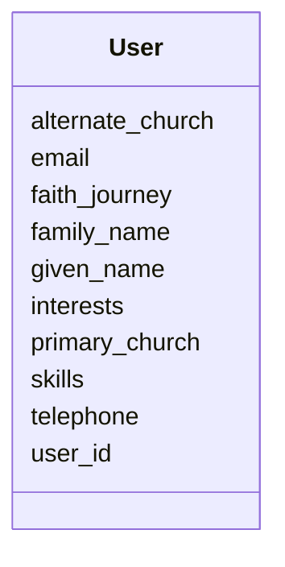

# Class: User 


_A registered platform user._


URI: [gc:User](https://global.church/schema/User)





<!-- no inheritance hierarchy -->


## Slots

| Name | Cardinality and Range | Description | Inheritance |
| ---  | --- | --- | --- |
| [user_id](user_id.md) | 1 <br/> [Uuid](Uuid.md) | Primary key for User (also referenced by other tables) | direct |
| [given_name](given_name.md) | 0..1 <br/> [String](String.md) | First name | direct |
| [family_name](family_name.md) | 0..1 <br/> [String](String.md) | Last name | direct |
| [email](email.md) | 0..1 <br/> [email](email.md) | Main contact email | direct |
| [telephone](telephone.md) | 0..1 <br/> [PhoneE164](PhoneE164.md) | Phone number (international format recommended) | direct |
| [skills](skills.md) | 0..1 <br/> [String](String.md) | Comma-separated list of user skills | direct |
| [primary_church](primary_church.md) | 0..1 <br/> [Uuid](Uuid.md) | FK → Church | direct |
| [alternate_church](alternate_church.md) | 0..1 <br/> [Uuid](Uuid.md) | Optional FK → Church | direct |
| [interests](interests.md) | 0..1 <br/> [String](String.md) | Free-text interests or ministry areas | direct |
| [faith_journey](faith_journey.md) | 0..1 <br/> [String](String.md) | Narrative text describing the user’s faith journey | direct |


## Identifier and Mapping Information


### Schema Source


* from schema: https://global.church/schema


## Mappings

| Mapping Type | Mapped Value |
| ---  | ---  |
| self | gc:User |
| native | gc:User |
| undefined | schema:Person |


## LinkML Source

<!-- TODO: investigate https://stackoverflow.com/questions/37606292/how-to-create-tabbed-code-blocks-in-mkdocs-or-sphinx -->

### Direct

<details>
```yaml
name: User
description: A registered platform user.
in_subset:
- user_core
- public
from_schema: https://global.church/schema
mappings:
- schema:Person
slots:
- user_id
- given_name
- family_name
- email
- telephone
- skills
- primary_church
- alternate_church
- interests
- faith_journey

```
</details>

### Induced

<details>
```yaml
name: User
description: A registered platform user.
in_subset:
- user_core
- public
from_schema: https://global.church/schema
mappings:
- schema:Person
attributes:
  user_id:
    name: user_id
    description: Primary key for User (also referenced by other tables).
    in_subset:
    - public
    - user_core
    from_schema: https://global.church/schema
    exact_mappings:
    - schema:identifier
    rank: 1000
    identifier: true
    alias: user_id
    owner: User
    domain_of:
    - User
    range: uuid
  given_name:
    name: given_name
    description: First name.
    in_subset:
    - user_core
    - pii
    from_schema: https://global.church/schema
    exact_mappings:
    - schema:givenName
    rank: 1000
    alias: given_name
    owner: User
    domain_of:
    - User
    range: string
  family_name:
    name: family_name
    description: Last name.
    in_subset:
    - user_core
    - pii
    from_schema: https://global.church/schema
    exact_mappings:
    - schema:familyName
    rank: 1000
    alias: family_name
    owner: User
    domain_of:
    - User
    range: string
  email:
    name: email
    description: Main contact email.
    in_subset:
    - user_core
    - internal
    - pii
    from_schema: https://global.church/schema
    exact_mappings:
    - schema:email
    rank: 1000
    alias: email
    owner: User
    domain_of:
    - User
    range: email
  telephone:
    name: telephone
    description: Phone number (international format recommended).
    in_subset:
    - internal
    - pii
    from_schema: https://global.church/schema
    exact_mappings:
    - schema:telephone
    rank: 1000
    alias: telephone
    owner: User
    domain_of:
    - User
    range: phone_e164
  skills:
    name: skills
    description: Comma-separated list of user skills.
    in_subset:
    - internal
    from_schema: https://global.church/schema
    exact_mappings:
    - schema:skills
    rank: 1000
    alias: skills
    owner: User
    domain_of:
    - User
    range: string
  primary_church:
    name: primary_church
    description: FK → Church.church_id (the user’s primary church).
    in_subset:
    - internal
    from_schema: https://global.church/schema
    rank: 1000
    alias: primary_church
    owner: User
    domain_of:
    - User
    range: uuid
  alternate_church:
    name: alternate_church
    description: Optional FK → Church.church_id (secondary church).
    in_subset:
    - internal
    from_schema: https://global.church/schema
    rank: 1000
    alias: alternate_church
    owner: User
    domain_of:
    - User
    range: uuid
  interests:
    name: interests
    description: Free-text interests or ministry areas.
    in_subset:
    - internal
    from_schema: https://global.church/schema
    exact_mappings:
    - schema:interest
    rank: 1000
    alias: interests
    owner: User
    domain_of:
    - User
    range: string
  faith_journey:
    name: faith_journey
    description: Narrative text describing the user’s faith journey.
    in_subset:
    - internal
    from_schema: https://global.church/schema
    rank: 1000
    alias: faith_journey
    owner: User
    domain_of:
    - User
    range: string

```
</details>