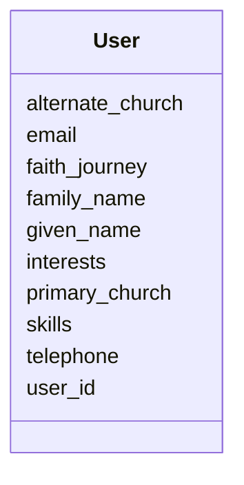

# Class: User 


_A registered platform user._


URI: [gc:User](https://global.church/schema/User)





<!-- no inheritance hierarchy -->


## Slots

| Name | Cardinality and Range | Description | Inheritance |
| ---  | --- | --- | --- |
| [user_id](user_id.md) | 1 <br/> [Uuid](Uuid.md) | Unique ID for a registered platform user | direct |
| [given_name](given_name.md) | 0..1 <br/> [String](String.md) | User’s first (given) name | direct |
| [family_name](family_name.md) | 0..1 <br/> [String](String.md) | User’s last (family) name | direct |
| [email](email.md) | 0..1 <br/> [email](email.md) | Primary contact email for the user | direct |
| [telephone](telephone.md) | 0..1 <br/> [PhoneE164](PhoneE164.md) | User’s phone number (E | direct |
| [skills](skills.md) | * <br/> [String](String.md) | List of user skills | direct |
| [primary_church](primary_church.md) | 0..1 <br/> [Uuid](Uuid.md) | FK to the user’s primary Church | direct |
| [alternate_church](alternate_church.md) | 0..1 <br/> [String](String.md) | Optional FK to a secondary/alternate Church | direct |
| [interests](interests.md) | 0..1 <br/> [String](String.md) | User’s interests or ministry areas | direct |
| [faith_journey](faith_journey.md) | 0..1 <br/> [String](String.md) | Narrative of the user’s faith journey | direct |


## Identifier and Mapping Information


### Schema Source


* from schema: https://global.church/schema


## Mappings

| Mapping Type | Mapped Value |
| ---  | ---  |
| self | gc:User |
| native | gc:User |
| undefined | schema:Person |


## LinkML Source

<!-- TODO: investigate https://stackoverflow.com/questions/37606292/how-to-create-tabbed-code-blocks-in-mkdocs-or-sphinx -->

### Direct

<details>
```yaml
name: User
description: A registered platform user.
in_subset:
- user_core
- public
from_schema: https://global.church/schema
mappings:
- schema:Person
slots:
- user_id
- given_name
- family_name
- email
- telephone
- skills
- primary_church
- alternate_church
- interests
- faith_journey

```
</details>

### Induced

<details>
```yaml
name: User
description: A registered platform user.
in_subset:
- user_core
- public
from_schema: https://global.church/schema
mappings:
- schema:Person
attributes:
  user_id:
    name: user_id
    description: Unique ID for a registered platform user.
    comments:
    - 'This is the stable, system-issued identifier for a user.

      It is used as the primary key and as the target of foreign keys in related tables.

      Must be a valid UUID (v4 recommended). Never reuse or recycle a user_id.

      '
    examples:
    - value: 550e8400-e29b-41d4-a716-446655440000
      description: Example UUID for a user record.
    - value: 3fa85f64-5717-4562-b3fc-2c963f66afa6
      description: Another valid UUID.
    from_schema: https://global.church/schema
    exact_mappings:
    - schema:identifier
    rank: 1000
    identifier: true
    alias: user_id
    owner: User
    domain_of:
    - User
    range: uuid
  given_name:
    name: given_name
    description: User’s first (given) name.
    comments:
    - 'Use the person’s preferred first name. Do not include middle names or initials
      here.

      For organizations or teams, this slot should be left empty.

      '
    examples:
    - value: Ava
      description: Simple given name.
    - value: Jean-Luc
      description: Hyphenated given name.
    in_subset:
    - user_core
    - pii
    from_schema: https://global.church/schema
    exact_mappings:
    - schema:givenName
    rank: 1000
    alias: given_name
    owner: User
    domain_of:
    - User
    range: string
  family_name:
    name: family_name
    description: User’s last (family) name.
    comments:
    - 'Store the surname only. Do not include suffixes (e.g., Jr., III) or prefixes
      (e.g., Dr.).

      If the person has a single name, leave this blank and use given_name only.

      '
    examples:
    - value: Sikute
      description: Standard family name.
    - value: O'Neil
      description: Family name with punctuation.
    in_subset:
    - user_core
    - pii
    from_schema: https://global.church/schema
    exact_mappings:
    - schema:familyName
    rank: 1000
    alias: family_name
    owner: User
    domain_of:
    - User
    range: string
  email:
    name: email
    description: Primary contact email for the user.
    comments:
    - 'Must satisfy the `email` scalar pattern (simplified RFC 5322).

      Use the address the user prefers for platform communication.

      For church emails discovered via scraping, use `scraped_email` on EnrichedData
      instead.

      '
    examples:
    - value: trent@example.org
      description: Typical user email.
    - value: ava.smith+globalchurch@gmail.com
      description: Address with plus-tag.
    in_subset:
    - user_core
    - internal
    - pii
    from_schema: https://global.church/schema
    exact_mappings:
    - schema:email
    rank: 1000
    alias: email
    owner: User
    domain_of:
    - User
    range: email
  telephone:
    name: telephone
    description: User’s phone number (E.164).
    comments:
    - 'Store numbers in E.164 format (e.g., +14155552671). Country code is required.

      Do not include spaces, parentheses, or dashes. For church phone, use `phone`
      slot.

      '
    examples:
    - value: '+13105551234'
      description: US number in E.164 format.
    - value: '+442071838750'
      description: UK number in E.164 format.
    in_subset:
    - internal
    - pii
    from_schema: https://global.church/schema
    exact_mappings:
    - schema:telephone
    rank: 1000
    alias: telephone
    owner: User
    domain_of:
    - User
    range: phone_e164
  skills:
    name: skills
    description: List of user skills.
    comments:
    - 'Use a controlled list where possible (e.g., “photography”, “youth_ministry”,
      “python”).

      This slot is multivalued—store each skill as a separate list item.

      '
    examples:
    - value: '["photography", "youth_ministry", "python"]'
      description: Three discrete skills as a JSON array string.
    in_subset:
    - internal
    from_schema: https://global.church/schema
    exact_mappings:
    - schema:skills
    rank: 1000
    alias: skills
    owner: User
    domain_of:
    - User
    range: string
    multivalued: true
  primary_church:
    name: primary_church
    description: FK to the user’s primary Church.
    comments:
    - 'Points to `Church.church_id`. Use when a user affiliates with a single congregation.

      If the user participates at multiple churches, consider also setting `alternate_church`.

      '
    examples:
    - value: a4b7b3a1-2c6e-4b0a-8c0a-2d6e5c9a2f11
      description: UUID of the primary church.
    in_subset:
    - internal
    from_schema: https://global.church/schema
    rank: 1000
    alias: primary_church
    owner: User
    domain_of:
    - User
    range: uuid
  alternate_church:
    name: alternate_church
    description: Optional FK to a secondary/alternate Church.
    comments:
    - 'Points to `Church.church_id`. Use when a user has a secondary affiliation

      (e.g., a campus they visit occasionally). Leave empty if not applicable.

      '
    examples:
    - value: 3fa85f64-5717-4562-b3fc-2c963f66afa6
      description: UUID of an alternate church.
    - value: 00000000-0000-0000-0000-000000000000
      description: Empty/placeholder not valid—use null instead.
    from_schema: https://global.church/schema
    rank: 1000
    alias: alternate_church
    owner: User
    domain_of:
    - User
    range: string
  interests:
    name: interests
    description: User’s interests or ministry areas.
    comments:
    - 'Free text or tags describing ministry passions (e.g., “missions”, “children”,
      “tech”).

      Prefer consistent tagging conventions to improve searchability.

      '
    examples:
    - value: missions, photography, discipleship
      description: Comma-separated input that will be normalized.
    - value: youth_ministry
      description: Single interest term.
    in_subset:
    - internal
    from_schema: https://global.church/schema
    exact_mappings:
    - schema:interest
    rank: 1000
    alias: interests
    owner: User
    domain_of:
    - User
    range: string
  faith_journey:
    name: faith_journey
    description: Narrative of the user’s faith journey.
    comments:
    - 'Long-form text. May include testimony, baptism date, or ministry milestones.

      Avoid storing sensitive counseling notes in this field.

      '
    examples:
    - value: Came to faith in 2016; baptized in 2017; serving in college ministry.
      description: Concise narrative.
    - value: Exploring faith; interested in Alpha course.
      description: Short current-state note.
    in_subset:
    - internal
    from_schema: https://global.church/schema
    rank: 1000
    alias: faith_journey
    owner: User
    domain_of:
    - User
    range: string

```
</details>